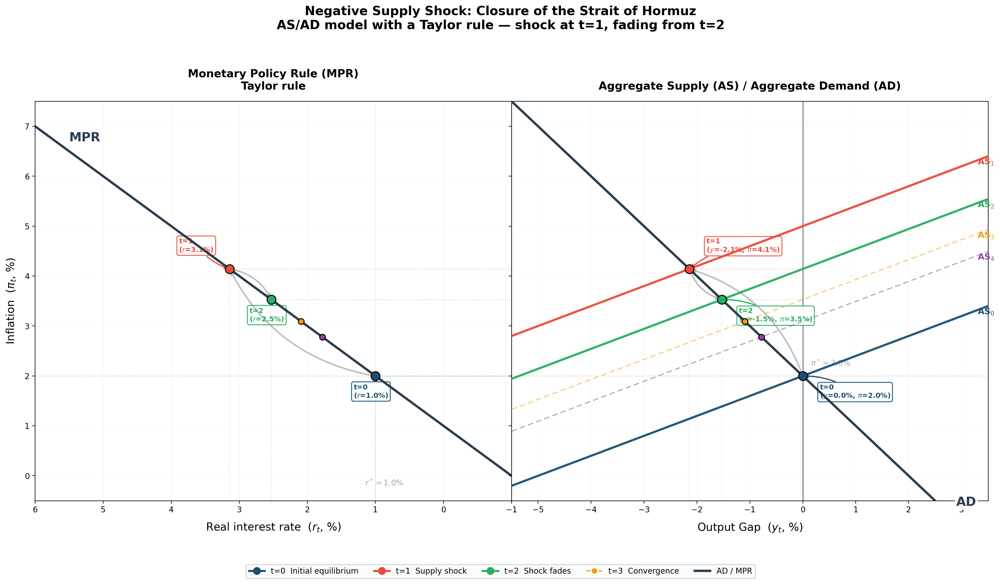

# Strait of Hormuz Supply Shock Model

A compact macroeconomic simulation of a negative supply shock caused by a hypothetical closure of the Strait of Hormuz.

The project uses a three-equation New Keynesian framework to trace the effect on inflation, the output gap and the real policy rate. It is an analytical illustration rather than a forecasting model.

## Model

| Block | Equation | Role |
| --- | --- | --- |
| Phillips curve | `pi_t = pi_(t-1) + gamma * y_t + epsilon_t` | Inflation dynamics |
| IS curve | `y_t = -alpha * (r_t - r*)` | Output gap response |
| Taylor rule | `r_t = r* + phi_pi * (pi_t - pi*) + phi_y * y_t` | Policy-rate reaction |

## Result

The script generates a two-panel chart:

- Monetary-policy rule: the interest-rate response to inflation and activity.
- Aggregate supply and demand: the path from the initial equilibrium through the shock and subsequent convergence.



## Parameters

| Parameter | Value | Description |
| --- | --- | --- |
| `pi*` | 2.0% | Inflation target |
| `r*` | 1.0% | Natural real interest rate |
| `phi_pi` | 1.5 | Taylor-rule coefficient on inflation |
| `phi_y` | 0.5 | Taylor-rule coefficient on the output gap |
| `gamma` | 0.4 | Phillips-curve slope |
| `epsilon` | 3.0 pp | Supply-shock magnitude |

## Run It

```bash
python -m venv .venv
source .venv/bin/activate
pip install -r requirements.txt
python hormuz_oa_da_model.py
```

The chart is written to `hormuz_oa_da_taylor.png` in the project directory.

## Scope

The shock is exogenous and temporary, expectations are backward-looking, and the response coefficients are calibrated rather than estimated. Those choices keep the mechanics transparent, but they also mean the output should be read as comparative dynamics rather than a real-world forecast.

## License

MIT
